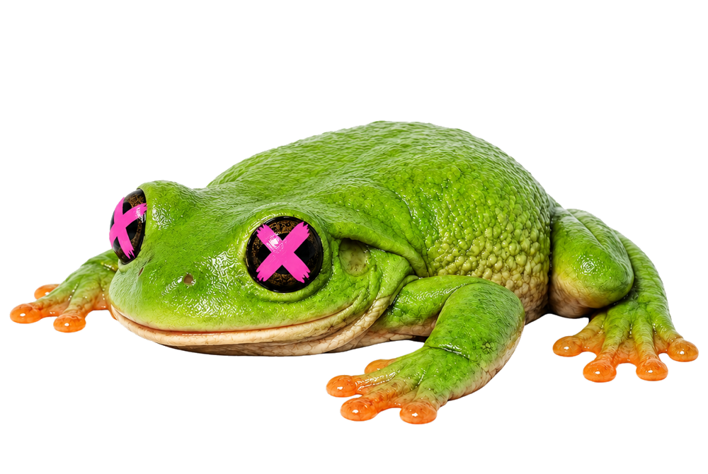
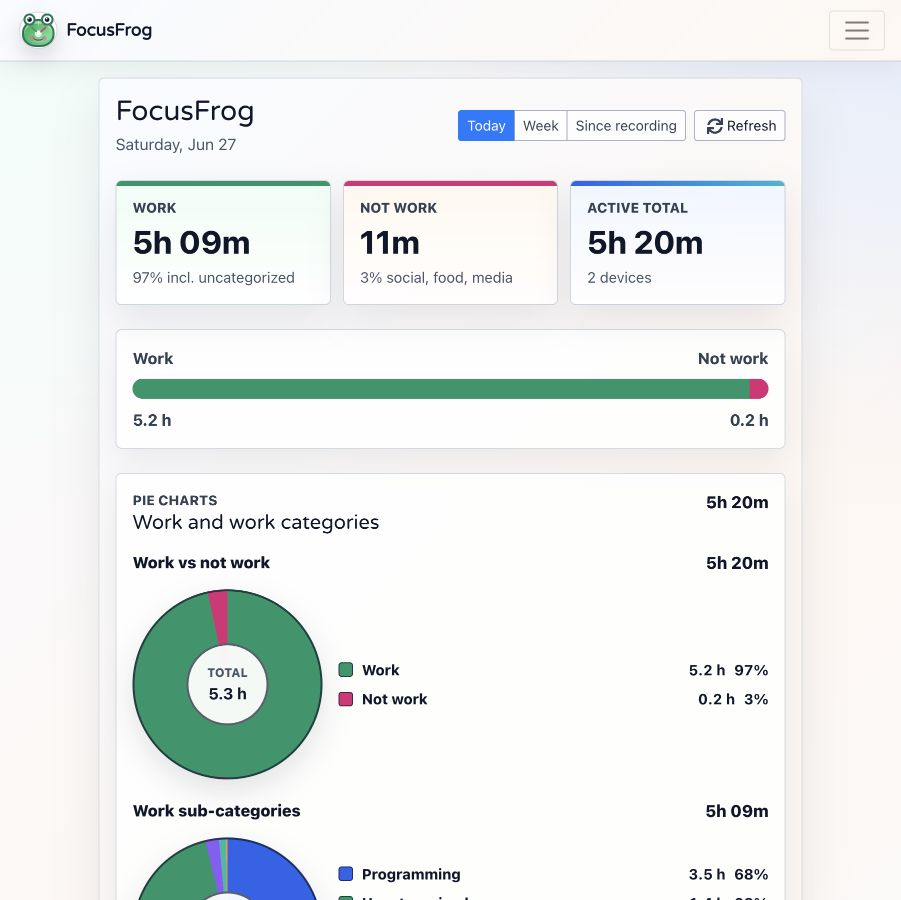
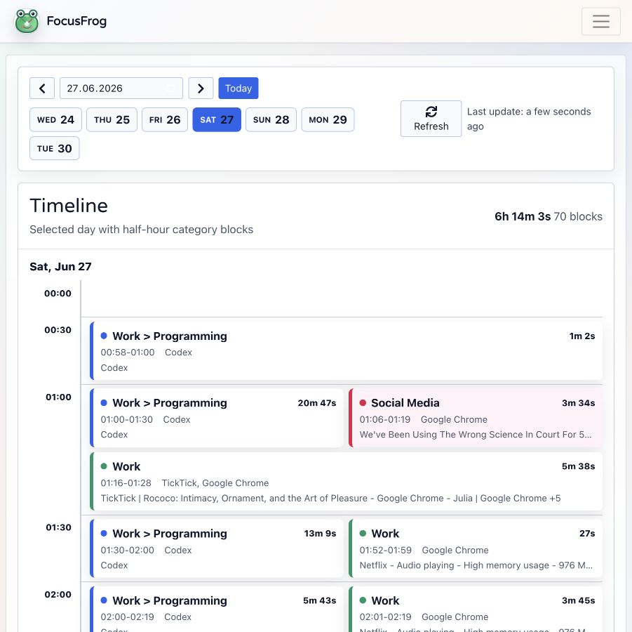
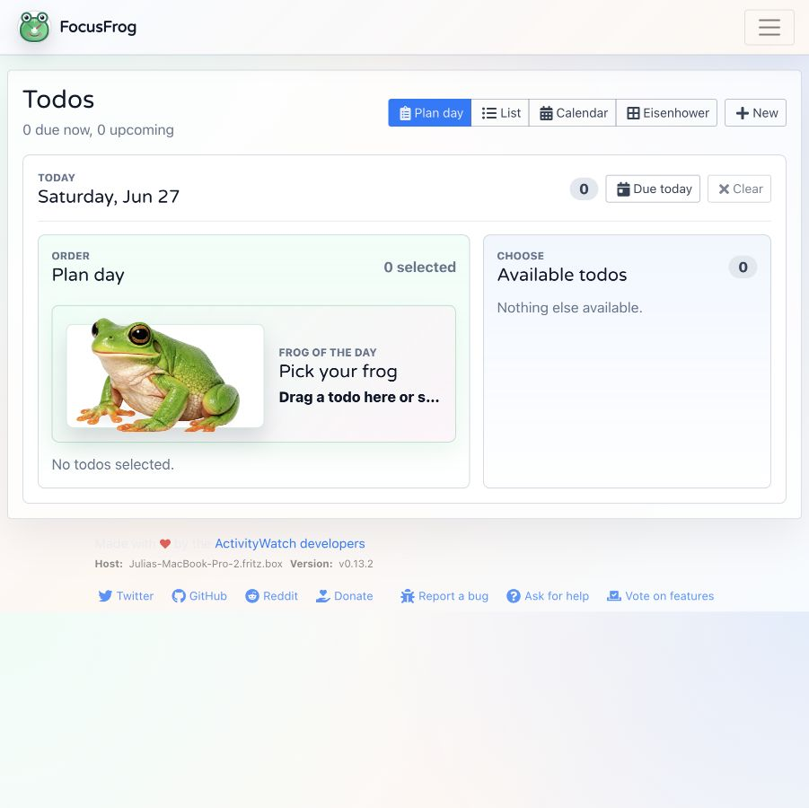
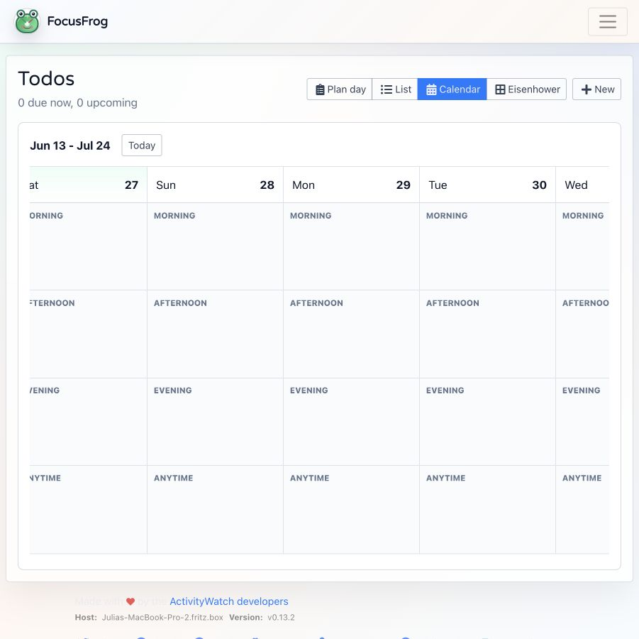
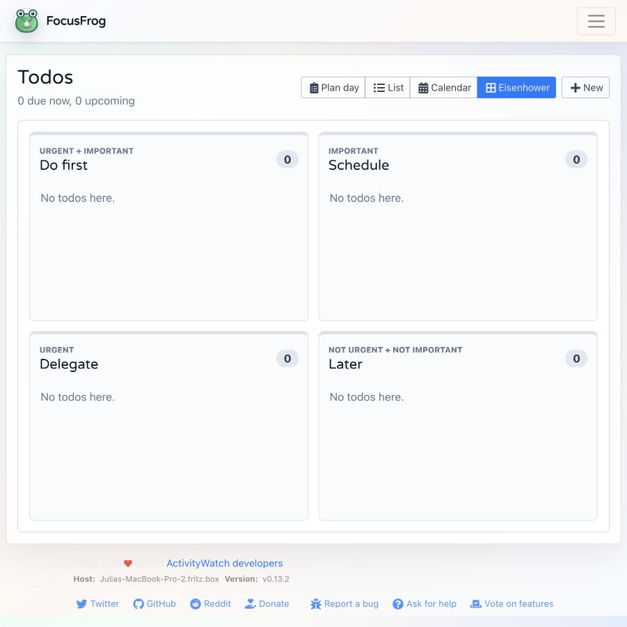
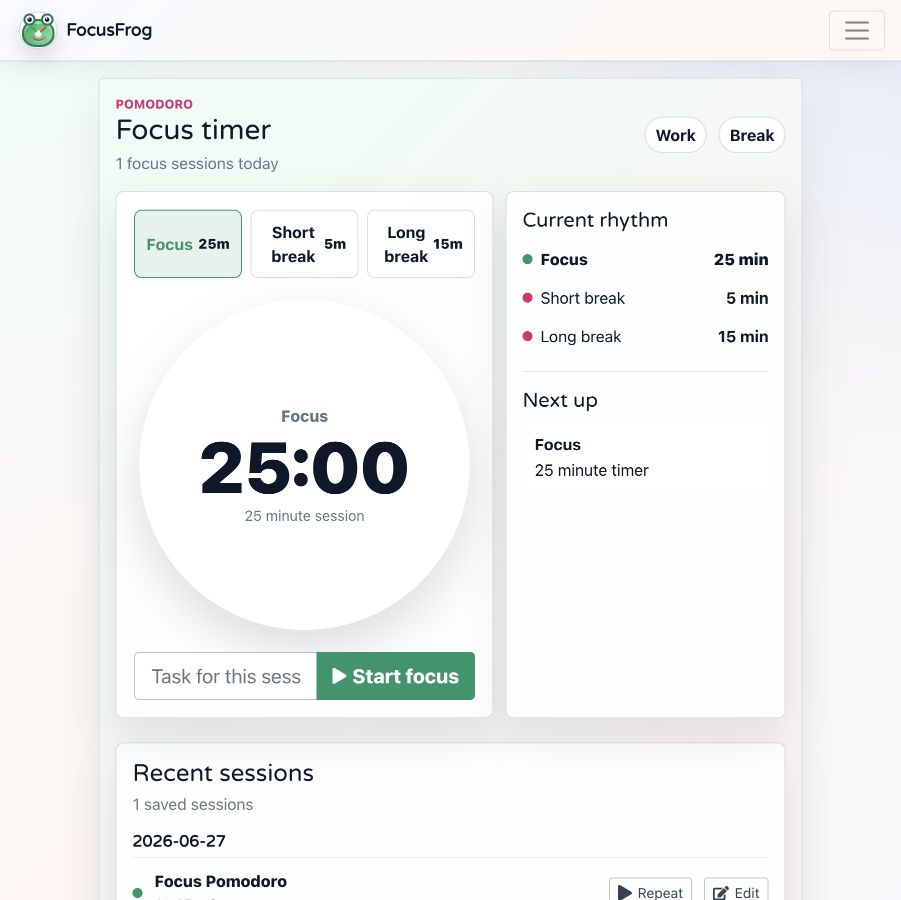

<p align="center">
  
</p>

<h1 align="center">FocusFrog</h1>

<p align="center">
  <strong>Local-first time tracking, day planning, and Pomodoro focus built on ActivityWatch.</strong>
</p>

<p align="center">
  See how your laptop time is spent, plan what matters today, and stay on track without sending your data to a cloud service.
</p>

---

## What It Is

FocusFrog is a custom web UI for ActivityWatch. It keeps ActivityWatch's local time-tracking foundation, then adds a more opinionated daily workflow:

- understand work vs. non-work time at a glance
- inspect exactly when different kinds of activity happened
- plan today's todos in order
- choose the one task to do first
- run Pomodoro sessions with gentle distraction nudges

It is meant to feel like a quiet personal dashboard: useful enough for daily use, but not loud or gamified for its own sake.

## Fork Notice

FocusFrog is a fork/customization of the ActivityWatch web interface. It is built on top of the open-source ActivityWatch project and keeps the same local tracking foundation.

- Upstream project: [activitywatch/activitywatch](https://github.com/activitywatch/activitywatch)
- Web UI base: [ActivityWatch/aw-webui](https://github.com/ActivityWatch/aw-webui)
- License: MPL-2.0, inherited from ActivityWatch aw-webui

## Screenshots

### Hours Dashboard

Work, life, active total, work-life balance, pie charts, and Today timelines.



### Timeline

A day-level timetable that groups activity into readable category blocks.



### Todos And Planning

Plan the day, order todos, and pick the first important task to handle.



<table>
  <tr>
    <td width="50%">
      <strong>Calendar</strong><br />
      
    </td>
    <td width="50%">
      <strong>Eisenhower Matrix</strong><br />
      
    </td>
  </tr>
</table>

### Pomodoro

A focus timer with work and break modes, session history, and a distraction reminder when tracked activity looks off-task.



## Highlights

### Time That Is Actually Useful

The Hours page turns ActivityWatch events into a practical work dashboard:

- Today, Week, and Since recording ranges
- Monday-to-Sunday week view
- work, not-work, and active-total summaries
- a weighted work-life balance scale where life is every elapsed hour not counted as work
- work vs. not-work pie chart
- work sub-category pie chart
- cumulative Today chart showing how work builds over the day
- hourly Today chart showing how much work happened in each hour
- detailed report and raw data links when you need to inspect the source

### A Timeline You Can Read

The Timeline page is built for answering "when did I do what?" without opening raw event tables.

- full-day vertical timetable
- half-hour anchors
- category-colored activity blocks
- summarized repeated activity
- day selector for moving through history

### Todos With Multiple Views

Todos are stored locally in the browser and can be viewed in the shape that fits the moment.

- Plan day view for choosing today's work
- List view for due and upcoming tasks
- Calendar view for moving tasks between morning, afternoon, evening, and anytime
- Eisenhower matrix for urgent/important sorting
- recurring todos
- modal todo editor that opens only when needed
- drag-and-drop movement between calendar lanes and matrix quadrants

### Frog Of The Day

The planning view keeps one task visually front and center. Drag a todo into the frog card, or let the first planned todo become the default. Completing it gives a small visual reward and keeps the frog done for the rest of the day.

### Pomodoro That Uses Your Activity

The Pomodoro page is connected to the same categorization logic as the time dashboard.

- focus, short break, and long break modes
- session labels
- recent session history
- flower animation while a timer runs
- optional distraction popup when current activity looks like non-work during a focus session

### Themes

FocusFrog includes three visual modes:

- bright mode for everyday use
- contrast mode for stronger readability
- flower mode with a softer decorative background

The theme switcher is global, so Hours, Timeline, Pomodoro, Todos, and Settings stay consistent.

## How It Works

FocusFrog reads local ActivityWatch buckets, especially:

- `aw-watcher-window` for active app/window events
- `aw-watcher-afk` for filtering out away time

Those events are categorized into useful groups such as programming, writing, email, messages and calls, social media, food, and uncategorized work. The UI then uses those categories across charts, timelines, Pomodoro distraction checks, and reports.

For reading-heavy work, FocusFrog adds a small AFK grace window after active input so the dashboard is less strict than raw keyboard/mouse activity alone.

The work-life balance scale treats work as tracked work time. Everything else in the selected elapsed period is life. Life is weighted by `40 / (168 - 40) = 0.31`, so a full week balances at 40 hours of work and 128 hours of life.

## Quick Start

Start ActivityWatch first:

```bash
aw-qt
```

Then run the web UI:

```bash
npm install
npm run serve
```

Open:

```text
http://127.0.0.1:27180
```

For a production build:

```bash
npm run build
```

The built files are written to `dist/`.

## Clickable macOS App

You can package FocusFrog as a small macOS app bundle:

```bash
npm run package:mac
```

This creates:

```text
dist/FocusFrog.app
```

Double-clicking `FocusFrog.app` opens the FocusFrog dashboard. The app bundle includes the production web UI and starts a small background LaunchAgent server on `http://127.0.0.1:27180`. That server proxies `/api` requests to ActivityWatch, so the Dock icon does not need to stay open.

The launcher tries to start or reuse ActivityWatch from common locations, including `/Applications/ActivityWatch.app`. ActivityWatch still owns the actual tracking and local database; FocusFrog is the dashboard and planning interface on top.

The app icon is generated from `static/logo.png`.

## Native macOS Widget

FocusFrog also has a real WidgetKit widget scaffold in `native/macos-widget/`. It shows today's work, not-work, active total, and a small pie chart directly in macOS widgets.

Build the normal app first so the local server includes the widget data endpoint:

```bash
npm run package:mac
```

Then build the native widget host app:

```bash
npm run package:mac-widget
```

Full Xcode is required for this step; Apple's Command Line Tools alone cannot package WidgetKit extensions. After building, run `dist/FocusFrogNative.app` once, then open Notification Center or Control-click the Desktop, choose `Edit Widgets`, search for `FocusFrog`, and add the small or medium widget.

The native widget reads only from the local FocusFrog server at `http://127.0.0.1:27180/focusfrog-widget-summary`, so the regular FocusFrog app/server must be running for live values.

## Portable Windows Package

You can also build a portable Windows package:

```bash
npm run package:windows
```

This creates:

```text
dist/FocusFrog-win32/
dist/FocusFrog-win32.zip
```

On Windows, unzip the package and run `FocusFrog.cmd`. The launcher starts the local FocusFrog server, opens `http://127.0.0.1:27180/#/home`, and proxies ActivityWatch API requests to the local ActivityWatch server.

The Windows package requires Node.js on `PATH` and an installed or running ActivityWatch. FocusFrog todos and planning state are stored in `%APPDATA%\FocusFrog\storage.json`.

## Using It With ActivityWatch

If you want to use a built version with your normal ActivityWatch install, copy the `dist/` assets into the static web directory used by your ActivityWatch server, or point `aw-server-rust` at the build output:

```bash
aw-server-rust --webpath /path/to/aw-webui/dist
```

If you are developing against a local ActivityWatch server, the dev server proxies API requests to the local backend.

## Privacy

FocusFrog is local-first. It reads from your local ActivityWatch server and does not require an account. Your time data, todos, and planning state stay on your machine unless you choose to export or publish them yourself.

## Development

Common commands:

```bash
npm run serve
npm run build
npm test
npm run package:mac
npm run package:windows
```

The app is built with Vue 2, BootstrapVue, Pinia, and the ActivityWatch client APIs.

## Credits

FocusFrog is built on top of [ActivityWatch](https://activitywatch.net/) and the original `aw-webui` project. ActivityWatch provides the local tracking foundation; FocusFrog adds the focused dashboard, planning, theme, and Pomodoro workflow on top.
